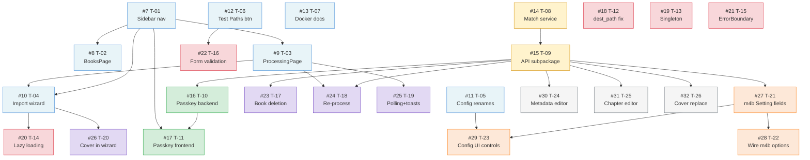

# Bragibooks — Ticket Breakdown

Mapped from `restructure-and-passkeys.md`. Dependencies noted where a ticket cannot start until another lands.

Labels used: `refactor` `feat` `bug` `chore` `frontend` `backend`

---

## Phase 0 — UX & Navigation

### T-01 · Restructure sidebar navigation
`feat` `frontend`

Reorder the sidebar so Import is first. Add placeholder routes for Processing and Security (can be empty pages). Remove Queue and Import History nav entries (they'll redirect).

**Acceptance criteria:**
- Sidebar order: Import → Library → Processing → Settings (Configuration, Security, Users, About)
- `/queue` and `/import-history` redirect to `/processing`
- All existing nav links still work

---

### T-02 · BooksPage — pure library view + empty state
`feat` `frontend`

Remove Processing and Error tabs from BooksPage. Show DONE books only. When the library is empty, show a full-page empty state with a CTA to import.

**Acceptance criteria:**
- BooksPage only shows books with `status = DONE`
- Empty state shows when `books.done.length === 0`: message + "Import your first book →" link to `/import`
- Existing search, sort, and pagination still work on the reduced book set

**Depends on:** T-01

---

### T-03 · New ProcessingPage
`feat` `frontend` `backend`

Replace `/queue` and `/import-history` with a single `/processing` page showing: currently processing, errors (with retry/delete actions), and recently completed books.

**Backend:** `GET /api/books/` already returns `processing` and `error` arrays — no new endpoint needed. The "recently completed" section uses `done` books ordered by `updated_at` desc.

**Acceptance criteria:**
- "Currently Processing" section lists books with PROCESSING status + spinner
- "Errors" section lists books with ERROR status, shows error message, has placeholder "Re-process" and "Delete" buttons (wired in T-13 and T-12)
- "Recently Completed" section shows last 10 DONE books chronologically
- Page auto-refreshes every 10s when books are processing (basic polling, fuller version in T-14)
- `/queue` and `/import-history` redirect here

**Depends on:** T-01

---

### T-04 · Import wizard — single-page multi-step flow
`feat` `frontend`

Consolidate `/import` + `/match` into a single two-step page at `/import`. Step 1: directory file browser. Step 2: ASIN search and confirmation per selected folder. No page navigation between steps.

**Acceptance criteria:**
- Step indicator shows current step (1 of 2 / 2 of 2)
- Step 1: file tree browser (lazy-loaded, wired in T-08), multi-select checkboxes, "Next: Match ASINs" button
- Step 2: one ASIN search card per selected directory, auto-populated search query from folder name, results shown inline with cover art thumbnails (T-15), "Confirm & Import" submits all matches
- "Back" button returns to Step 1 with selections preserved
- On successful submit, navigates to `/processing`
- `/match` route removed (logic absorbed here)

**Depends on:** T-01, T-03

---

### T-05 · Configuration page — field renames, annotations, path warning
`feat` `frontend` `backend`

Rename misleading fields, add one-line help text under each directory input, and warn when Archive Directory is a subdirectory of Input Directory.

**Backend:** Rename `completed_directory` → `archive_directory` in `Setting` model (migration + update all callsites). Update `SettingsAPI` serialization.

**Frontend:** Update labels and add `<Form.Text>` help annotations:
- Input Directory → "Where your source audiobook files live"
- Output Directory → "Where finished .m4b files are written"
- Completed Directory → Archive Directory → "Where source files are moved after processing (leave blank to keep in place)"
- Output Scheme → Folder Naming Pattern → show available tokens inline (see T-22)
- Inline warning if Archive Directory path starts with Input Directory path

**Acceptance criteria:**
- Migration runs cleanly, existing data preserved (field rename only)
- All three directory fields have help text
- Warning banner appears when archive dir is inside input dir
- API response uses new field name `archive_directory`

---

### T-06 · "Test Paths" button on Configuration page
`feat` `frontend` `backend`

Add a button that verifies all configured directory paths exist and are accessible, with per-field inline feedback.

**Backend:** `GET /api/settings/verify/` — checks each configured directory with `Path.is_dir()` and `os.access(..., os.W_OK)`. Returns `{ input_directory: "ok" | "missing" | "not_writable", ... }`.

**Frontend:** "Test Paths" button triggers the endpoint. Each field gets a green checkmark or red warning icon inline.

**Acceptance criteria:**
- Endpoint returns per-field status for all three directory paths
- Frontend shows per-field icons after button click
- No test is run until button clicked (not on every keystroke)

---

### T-07 · Docker-compose env var cleanup + dev mode docs
`chore`

Add `PASSKEY_*` vars as commented examples in the prod service block. Set `RUN_WORKER=true` as default in the dev profile. Clarify Docker vs. local dev in `docker-compose.yaml` comments and README.

**Acceptance criteria:**
- `PASSKEY_RP_ID`, `PASSKEY_RP_NAME`, `PASSKEY_ORIGIN` documented as commented examples under prod service
- Dev profile sets `RUN_WORKER=true` by default
- README dev section distinguishes "Docker dev" (built frontend) from "local dev" (Vite + Django separately)

---

## Phase 1 — Backend Restructure

### T-08 · Extract match service layer
`refactor` `backend`

Create `importer/services/match.py` with `MatchEntry` dataclass, `MatchValidationError`, and `process_match()` function. Update `MatchAPI.post()` to call the service instead of late-importing `MatchView`. Fixes A1, B1, A8.

**Acceptance criteria:**
- `importer/services/__init__.py` and `services/match.py` exist
- `process_match()` handles: ASIN format validation, Audible API validation, `create_book()`, task enqueue
- `MatchAPI.post()` has no import of `views.py`
- POST `/api/match/` with valid ASIN pair returns `{'success': True, 'books_queued': 1}`
- `grep -r "from .views import" importer/api.py` returns nothing

---

### T-09 · Restructure importer/api/ subpackage
`refactor` `backend`

Split the flat `api.py`, `auth_api.py`, `users_api.py` into `importer/api/` subpackage. Delete dead files. This is a single atomic commit. Fixes A3, A4, Q2, Q3.

**Files created:** `api/__init__.py`, `api/books.py` (with shared `serialize_book()`), `api/import_pipeline.py`, `api/config.py`, `api/auth.py`, `api/users.py`

**Files deleted:** `api.py`, `auth_api.py`, `users_api.py`, `views.py`, `forms.py`

**`urls.py`** updated to import from new subpackage paths.

**Acceptance criteria:**
- `python manage.py check` passes with zero errors
- All API endpoints respond identically to before
- `grep -r "from .views import\|from importer.views import" importer/` returns nothing
- `grep -r "from .forms import" importer/` returns nothing
- `logger.warn()` → `logger.warning()` in all new files (Q2)
- `VersionsAPI` bare `except:` → `except Exception` (Q3)
- `serialize_book()` is a single shared function used by both BooksListAPI and BookDetailAPI (A3)

**Depends on:** T-08

---

## Phase 2 — Passkeys

### T-10 · Passkey backend — model, settings, 6 API endpoints
`feat` `backend`

Add `PasskeyCredential` model, `PASSKEY_*` Django settings, and all six passkey API endpoints in `importer/api/auth.py`. Install `webauthn>=2.2.0`.

**New endpoints:**
- `GET /api/auth/passkey/register/begin/`
- `POST /api/auth/passkey/register/complete/`
- `GET /api/auth/passkey/login/begin/`
- `POST /api/auth/passkey/login/complete/` (`@csrf_exempt`)
- `GET /api/auth/passkeys/`
- `DELETE /api/auth/passkeys/<int:pk>/`

**Acceptance criteria:**
- `webauthn` added to `pyproject.toml`
- Migration `add_passkey_credential` runs cleanly
- `PASSKEY_RP_ID`, `PASSKEY_RP_NAME`, `PASSKEY_ORIGIN` in settings with env var overrides
- All 6 endpoints return correct JSON shapes
- Username/password login is completely unaffected

**Depends on:** T-09

---

### T-11 · Passkey frontend — SecurityPage + login button
`feat` `frontend`

Add `frontend/src/utils/webauthn.ts` (format utilities), `frontend/src/pages/SecurityPage.tsx` (manage passkeys), and the "Sign in with passkey" button on LoginPage.

**Acceptance criteria:**
- `SecurityPage` at `/settings/security`, visible to all authenticated users
- Lists registered passkeys with name, creation date, last-used date
- "Add a Passkey" section: name input + Register button
- Browser without WebAuthn support sees an informative warning instead
- LoginPage shows "Sign in with passkey" button only if `window.PublicKeyCredential` exists
- Full flow works: register → log out → sign in with passkey → land on `/`
- Username/password login still works independently on the same page

**Depends on:** T-10, T-01

---

## Phase 3 — Bug Fixes & Quick Wins

### T-12 · Fix dest_path escaping in merge.py
`bug` `backend`

Remove the `f"\""..."\""`  wrapping from `book.dest_path` assignment in `utils/merge.py`. Path should be a plain string with no embedded quote characters.

**Acceptance criteria:**
- `book.dest_path` contains a valid filesystem path with no literal `"` characters
- Processing a book results in a correct `dest_path` in the DB

---

### T-13 · Setting singleton enforcement
`bug` `backend`

Override `Setting.save()` to force `pk=1`. Add `Setting.load()` classmethod. Replace all `Setting.objects.first()` calls with `Setting.load()`. Fixes A5.

**Acceptance criteria:**
- Creating a second `Setting` row is impossible — `save()` always upserts pk=1
- `Setting.load()` returns the singleton, creating it if absent
- No `Setting.objects.first()` calls remain in the codebase

---

### T-14 · DirectoryListAPI lazy loading
`bug` `backend` `frontend`

Replace `rglob('*')` with lazy children via optional `?path=` query param. Returns only immediate children of the requested path. Fixes A7.

**Backend:** `GET /api/import/files/?path=some/subdir` returns `iterdir()` of that path under `input_directory`. Validate that the requested path doesn't escape `input_directory` (path traversal guard).

**Frontend (ImportPage wizard, T-04):** File tree fetches children lazily when a directory node is expanded.

**Acceptance criteria:**
- Response time is O(1) regardless of library size
- Expanding a directory node fetches only its immediate children
- Path traversal outside `input_directory` returns 400
- Selecting deeply-nested directories works

**Depends on:** T-04

---

### T-15 · React ErrorBoundary + BooksPage loading state
`bug` `frontend`

Wrap the main authenticated layout in a `React.ErrorBoundary` (Q4). Add spinner/skeleton to BooksPage during initial data load (Q5).

**Acceptance criteria:**
- Runtime error in any page shows a friendly error card with "Reload page" button instead of blank screen
- BooksPage shows spinner while `books === null` (not yet loaded)
- Existing behaviour unchanged when no errors occur

---

### T-16 · Settings form client-side validation + Test Paths
`feat` `frontend`

Add inline validation to `ConfigurationPage` before form submission. Also wires up the "Test Paths" button from T-06.

**Acceptance criteria:**
- `api_url` must start with `http://` or `https://`
- Directory fields must be non-empty and start with `/`
- `num_cpus` must be a non-negative integer
- Invalid fields show Bootstrap `is-invalid` styling with `invalid-feedback` message
- Form does not submit while any field is invalid

**Depends on:** T-06

---

## Phase 4 — Library Management Features

### T-17 · Book deletion
`feat` `backend` `frontend`

Add `DELETE /api/books/<id>/` endpoint. Add "Delete" button on BookDetailPage with a confirmation dialog. Fixes F1.

**Backend:** Deletes `Book` and cascade-deletes `Status`. Authors and Narrators are left (may belong to other books).

**Frontend:** "Delete" button on BookDetailPage opens a confirmation modal. On confirm, calls API, navigates to `/`, calls `refreshBooks()`.

**Acceptance criteria:**
- `DELETE /api/books/1/` removes the book and returns 204
- Button visible on BookDetailPage for all book statuses
- Confirmation dialog prevents accidental deletion
- Library updates immediately after deletion

**Depends on:** T-09

---

### T-18 · Re-process / retry / ASIN re-assignment
`feat` `backend` `frontend`

Add `POST /api/books/<id>/reprocess/` endpoint. Wire up "Re-process" buttons on ProcessingPage error cards. Fixes F2, A6, P4.

**Backend:** Accepts optional `{ "asin": "new_asin" }`. If new ASIN: updates book metadata from Audible API. Resets status to PROCESSING. Re-enqueues `m4b_merge_task`.

**Frontend:** "Re-process" button on error cards in ProcessingPage (T-03). Opens a small inline form for optional new ASIN. On DONE books in BookDetailPage, a "Re-process" button with a confirmation warning (will overwrite output file).

**Acceptance criteria:**
- Reprocess without new ASIN retries the same ASIN
- Reprocess with new ASIN updates title, authors, cover in DB before enqueuing
- Status resets to PROCESSING and book appears in "Currently Processing" section
- Error is cleared on retry

**Depends on:** T-09, T-03

---

### T-19 · DataContext polling + toast notifications
`feat` `frontend`

Poll `/api/books/` every 10s when books are processing. Show Bootstrap Toast when a book completes or errors. Fixes A2, F4.

**Polling:** `DataContext` starts interval when `books.processing.length > 0`, clears it when none are processing.

**Toasts:** When a book transitions PROCESSING → DONE: "✓ [Book Title] is ready" with link to library entry. PROCESSING → ERROR: "[Book Title] failed — view details" with link to ProcessingPage.

**Acceptance criteria:**
- No polling interval runs when nothing is processing
- Polling stops automatically when all books finish
- Toast appears within ~10s of a status change
- Toasts use Bootstrap 5 Toast component (no new library)
- Toast links navigate correctly

**Depends on:** T-03

---

### T-20 · Cover art in import wizard ASIN results
`feat` `frontend`

Display cover art thumbnail next to each ASIN search result in Step 2 of the import wizard. Fixes F6.

**Note:** No backend change needed — `AsinSearchAPI` results already include an `image` field.

**Acceptance criteria:**
- Each search result shows a thumbnail (approx 60×60px)
- Grey placeholder shown when `image` is null/missing
- Thumbnail doesn't break layout on small screens

**Depends on:** T-04

---

## Phase 5 — m4b-merge Processing Options

### T-21 · Expand Setting model with m4b processing options
`feat` `backend`

Add six new fields to the `Setting` model for M1–M5 processing options. Update `SettingsAPI` to serialize/deserialize them. Fixes M1–M5.

**New fields:** `skip_conversion` (bool), `audio_bitrate` (int, nullable), `audio_samplerate` (int, nullable), `chapter_source` (choice: audible/source_file), `ignore_source_tags` (bool), `chapter_name_format` (str)

**Acceptance criteria:**
- Migration `add_m4b_processing_options` runs cleanly
- `GET /api/settings/` includes all new fields
- `POST /api/settings/` saves all new fields
- Default values match current hardcoded behaviour (no behaviour change without UI change)

**Depends on:** T-09

---

### T-22 · Wire m4b processing options into merge pipeline
`feat` `backend`

Read the new Setting fields in `utils/merge.py:set_configs()` and pass them through to `M4bMerge` (or conditionally build `processing_args`). Fixes M1–M5 backend.

**Note:** If `m4b_merge` package doesn't expose these flags via `config`, subclass `M4bMerge` to override `prepare_command_args()`. Evaluate before implementing.

**Acceptance criteria:**
- `skip_conversion=True` passes `--no-conversion` when source is M4B/M4A
- `ignore_source_tags=False` omits `--ignore-source-tags` from args
- `chapter_source=source_file` skips Audible chapter data in `fix_chapters()`
- `audio_bitrate`/`audio_samplerate` override auto-detection when set
- `chapter_name_format` controls chapter naming in reformatted chapter files

**Depends on:** T-21

---

### T-23 · ConfigurationPage — m4b option controls + token docs
`feat` `frontend`

Add UI controls for the new m4b processing options and document the output scheme tokens. Fixes M1–M6.

**New controls:**
- Skip re-encoding: checkbox with help text
- Audio bitrate / sample rate: optional number inputs (blank = auto)
- Chapter source: radio group (Audible / Source file)
- Override source tags: checkbox
- Chapter name format: text input with live preview
- Folder naming pattern: help block listing all 8 available tokens

**Acceptance criteria:**
- All new controls save correctly via `POST /api/settings/`
- Token list is visible and accurate (author, title, series_name, series_position, subtitle, year, asin, narrator)
- Blank bitrate/samplerate fields save as `null` not `0`
- Page loads and saves without regression on existing fields

**Depends on:** T-21, T-05

---

## Phase 6 — Post-Processing / M4B Editing

### T-24 · Metadata editor for completed books
`feat` `backend` `frontend`

Allow editing book metadata after processing. Writes updated tags to the `.m4b` file using `m4b-tool meta`. Fixes P1.

**Backend:** `PUT /api/books/<id>/metadata/` — accepts `{title, author, narrator, year, description, genre}`, runs `m4b-tool meta` on `dest_path`, updates Book model fields.

**Frontend:** "Edit Metadata" button on BookDetailPage opens a modal with pre-filled fields. Save calls endpoint, updates local state on success.

**Acceptance criteria:**
- Edited metadata is reflected in the `.m4b` file tags (verify with `m4b-tool meta --print`)
- Book model fields updated in DB
- Only visible/actionable when `book.status === 'done'` and `dest_path` exists
- Error shown if `m4b-tool meta` fails

**Depends on:** T-09

---

### T-25 · Chapter editor
`feat` `backend` `frontend`

View and edit chapter list for a completed `.m4b`. Fixes P2.

**Backend:**
- `GET /api/books/<id>/chapters/` — reads `<dest_path>.chapters.txt`, returns `[{index, timestamp, name}]`
- `PUT /api/books/<id>/chapters/` — rewrites `.chapters.txt`, runs `mp4chaps -i <dest_path>.m4b`

**Frontend:** Expandable "Chapters" section on BookDetailPage. Editable table: timestamp | chapter name. Save button writes changes back.

**Acceptance criteria:**
- Chapters load from `.chapters.txt` file
- Editing a chapter name and saving updates the embedded chapter markers (verify with compatible player)
- Returns 404 if chapter file doesn't exist yet
- Only available when book status is DONE

**Depends on:** T-09

---

### T-26 · Cover art replacement
`feat` `backend` `frontend`

Replace cover art on a completed `.m4b` — either by uploading a file or re-fetching from Audible. Fixes P3.

**Backend:** `POST /api/books/<id>/cover/`
- `mode=upload`: accepts multipart JPEG, saves to temp, runs `m4b-tool meta --cover=<path> <dest_path>`
- `mode=refetch`: downloads from `book.cover_image_link`, embeds same way

**Frontend:** BookDetailPage shows current cover with "Replace Cover" button. Opens popover/modal with two options: file picker (upload) and "Re-fetch from Audible" one-click.

**Acceptance criteria:**
- Uploaded JPEG replaces embedded cover (verify visually in a player)
- Re-fetch downloads the cover from the Audible URL stored in `book.cover_image_link`
- Cover preview on BookDetailPage updates after replacement
- Only available when book status is DONE

**Depends on:** T-09

---

## Summary

| # | Title | Phase | Labels | Depends on | PR |
|---|-------|-------|--------|------------|----|
| T-01 | Restructure sidebar navigation | 0 | `feat` `frontend` | — | [#35](https://github.com/AceTugboat/bragibooks/pull/35) |
| T-02 | BooksPage — pure library + empty state | 0 | `feat` `frontend` | T-01 | — |
| T-03 | New ProcessingPage | 0 | `feat` `frontend` `backend` | T-01 | — |
| T-04 | Import wizard — single-page multi-step | 0 | `feat` `frontend` | T-01, T-03 | — |
| T-05 | Configuration page — field renames + warning | 0 | `feat` `frontend` `backend` | — | [#36](https://github.com/AceTugboat/bragibooks/pull/36) |
| T-06 | "Test Paths" button | 0 | `feat` `frontend` `backend` | — | [#36](https://github.com/AceTugboat/bragibooks/pull/36) |
| T-07 | Docker-compose env + dev mode docs | 0 | `chore` | — | [#33](https://github.com/AceTugboat/bragibooks/pull/33) |
| T-08 | Extract match service layer | 1 | `refactor` `backend` | — | [#34](https://github.com/AceTugboat/bragibooks/pull/34) |
| T-09 | Restructure importer/api/ subpackage | 1 | `refactor` `backend` | T-08 | — |
| T-10 | Passkey backend — model + 6 endpoints | 2 | `feat` `backend` | T-09 | — |
| T-11 | Passkey frontend — SecurityPage + login | 2 | `feat` `frontend` | T-10, T-01 | — |
| T-12 | Fix dest_path escaping | 3 | `bug` `backend` | — | [#34](https://github.com/AceTugboat/bragibooks/pull/34) |
| T-13 | Setting singleton enforcement | 3 | `bug` `backend` | — | [#34](https://github.com/AceTugboat/bragibooks/pull/34) |
| T-14 | DirectoryListAPI lazy loading | 3 | `bug` `backend` `frontend` | T-04 | — |
| T-15 | React ErrorBoundary + loading state | 3 | `bug` `frontend` | — | [#35](https://github.com/AceTugboat/bragibooks/pull/35) |
| T-16 | Settings form validation | 3 | `feat` `frontend` | T-06 | — |
| T-17 | Book deletion | 4 | `feat` `backend` `frontend` | T-09 | — |
| T-18 | Re-process / retry / ASIN re-assignment | 4 | `feat` `backend` `frontend` | T-09, T-03 | — |
| T-19 | DataContext polling + toasts | 4 | `feat` `frontend` | T-03 | — |
| T-20 | Cover art in import wizard | 4 | `feat` `frontend` | T-04 | — |
| T-21 | Setting model — m4b processing options | 5 | `feat` `backend` | T-09 | — |
| T-22 | Wire m4b options into merge pipeline | 5 | `feat` `backend` | T-21 | — |
| T-23 | ConfigurationPage — m4b controls + token docs | 5 | `feat` `frontend` | T-21, T-05 | — |
| T-24 | Metadata editor for completed books | 6 | `feat` `backend` `frontend` | T-09 | — |
| T-25 | Chapter editor | 6 | `feat` `backend` `frontend` | T-09 | — |
| T-26 | Cover art replacement | 6 | `feat` `backend` `frontend` | T-09 | — |
| SEC | Security: auth on API views, CSRF, DB creds | — | `bug` `backend` | — | [#37](https://github.com/AceTugboat/bragibooks/pull/37) |

---

## Dependency Graph

Arrows mean "must be completed before". Color = phase.



**Legend:** 🔵 Phase 0 · 🟡 Phase 1 · 🟢 Phase 2 · 🔴 Phase 3 · 🟣 Phase 4 · 🟠 Phase 5 · ⚪ Phase 6

---

## Parallel Work Streams

What can be worked on simultaneously at each stage.

### Wave 1 — No dependencies, start immediately

| Frontend stream | Backend stream | Standalone |
|----------------|----------------|------------|
| T-01 Sidebar nav | T-08 Match service | T-07 Docker docs |
| T-05 Config renames | T-12 dest_path fix | |
| T-06 Test Paths btn | T-13 Setting singleton | |
| T-15 ErrorBoundary | | |

> T-08 and T-01 are the two most important to start — they unblock almost everything else.

---

### Wave 2 — Unlocked after Wave 1

| Unlocked by | Tickets available |
|-------------|-------------------|
| T-01 | T-02 (BooksPage), T-03 (ProcessingPage) |
| T-06 | T-16 (Form validation) |
| T-08 | T-09 (API subpackage — atomic refactor) |

> T-09 is the major backend gate. Once it lands, Phases 2–6 backend work all open up.

---

### Wave 3 — Unlocked after Wave 2

| Unlocked by | Tickets available |
|-------------|-------------------|
| T-01 + T-03 | T-04 (Import wizard) |
| T-03 | T-19 (Polling + toasts) |
| T-09 | T-10 (Passkey backend), T-17 (Book deletion), T-21 (m4b Setting fields) |
| T-09 + T-03 | T-18 (Re-process) |

---

### Wave 4 — Unlocked after Wave 3

| Unlocked by | Tickets available |
|-------------|-------------------|
| T-04 | T-14 (Lazy loading), T-20 (Cover art in wizard) |
| T-10 + T-01 | T-11 (Passkey frontend) |
| T-21 | T-22 (Wire m4b options) |
| T-21 + T-05 | T-23 (Config UI controls) |
| T-09 | T-24 (Metadata editor), T-25 (Chapter editor), T-26 (Cover replace) |

> Phase 6 tickets (T-24, T-25, T-26) only need T-09 — they can start as soon as the backend restructure lands, independent of everything else in Phases 3–5.

---

### Critical Path

The longest chain from start to finish:

```
T-01 → T-03 → T-04 → T-14
T-08 → T-09 → T-10 → T-11
T-08 → T-09 → T-21 → T-22 → T-23
```

Finishing T-09 (backend restructure) is the single highest-leverage completion — it opens 10 downstream tickets simultaneously.